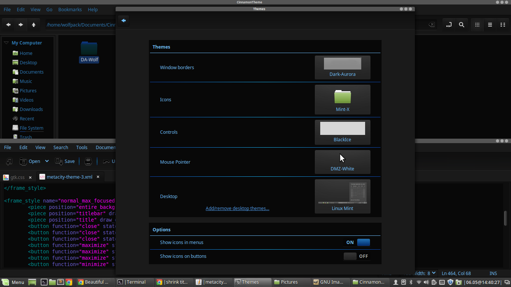

# CinnamonTheme
Customized Linux Mint 17.2 Theme using customized  Dark Aurora and BlackIce

## My Linux Mint 17.2 Theme
Uses customized Dark Aurora for the window borders, Black Ice 1.0 for the controls, stock Mint-X icons, stock Linux Mint desktop theme and DMZ White (stock pointer) for the mouse pointer.
I also set the titlebar font size to 6 in the Fonts settings for Cinnamon.  However, hopefully this isn't necessary, as I *believe* I have this set in the cinnamon.css file.

### Elements
[BlackIce 1.0](https://cinnamon-spices.linuxmint.com/themes/view/341) - Controls

[Dark Aurora](https://www.gnome-look.org/p/1013753/) - Window borders and titlebar

